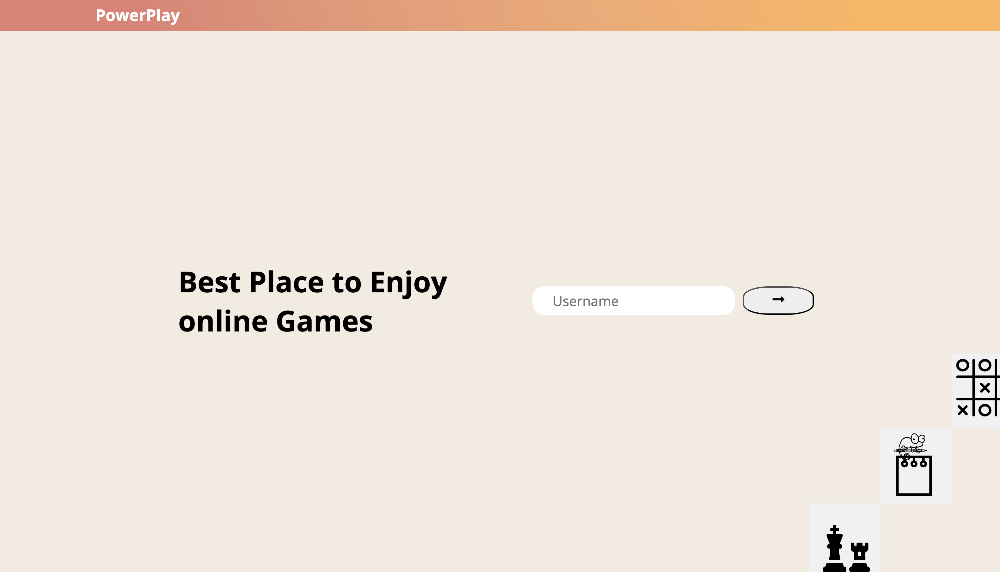
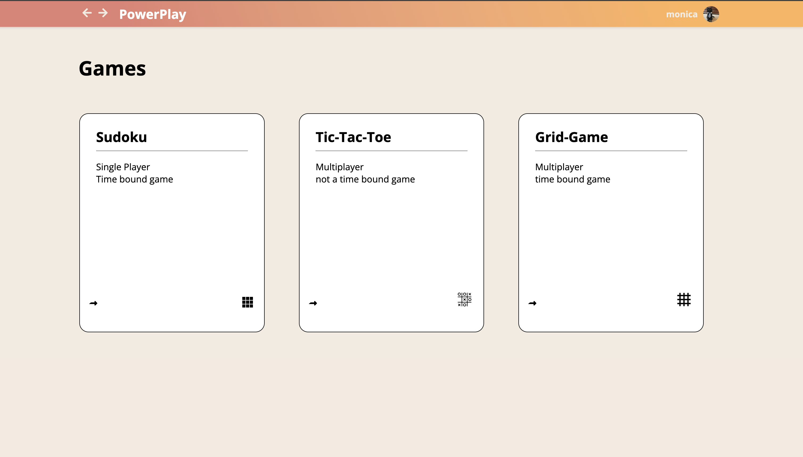
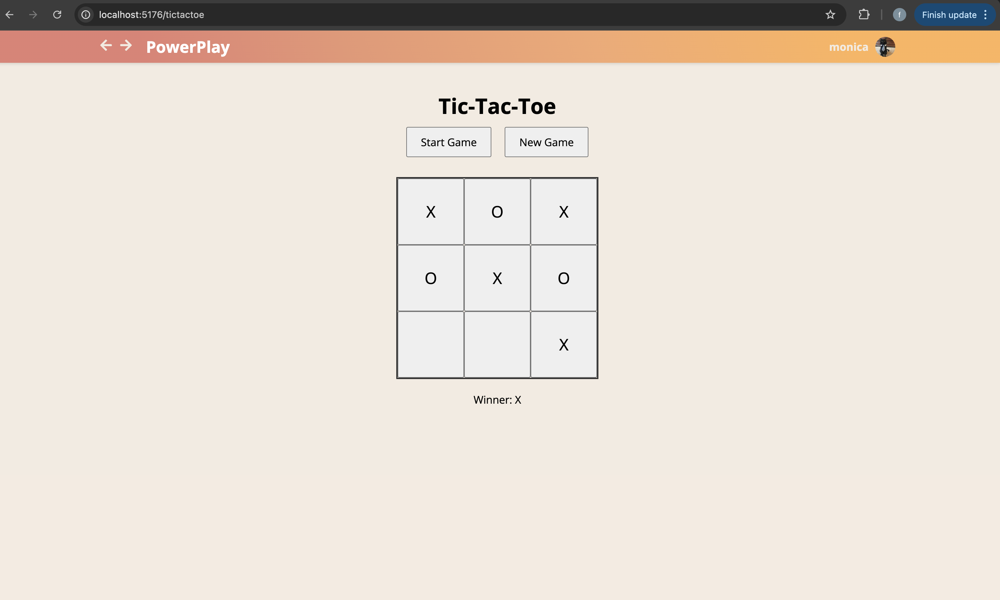
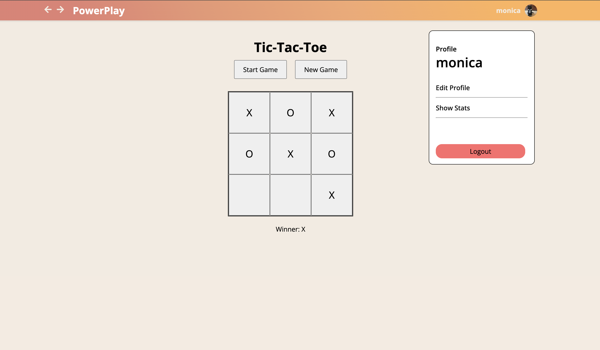
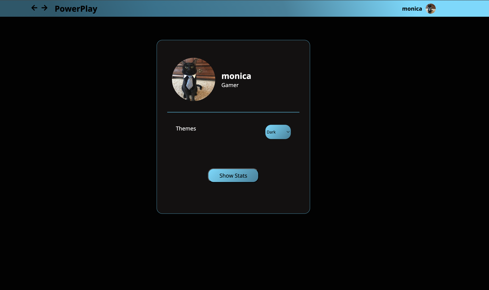
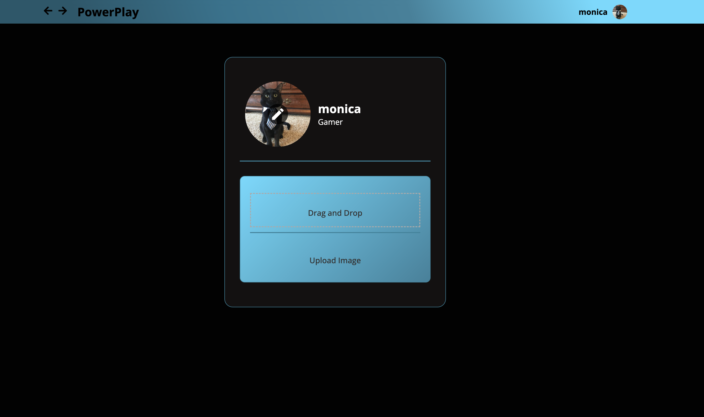
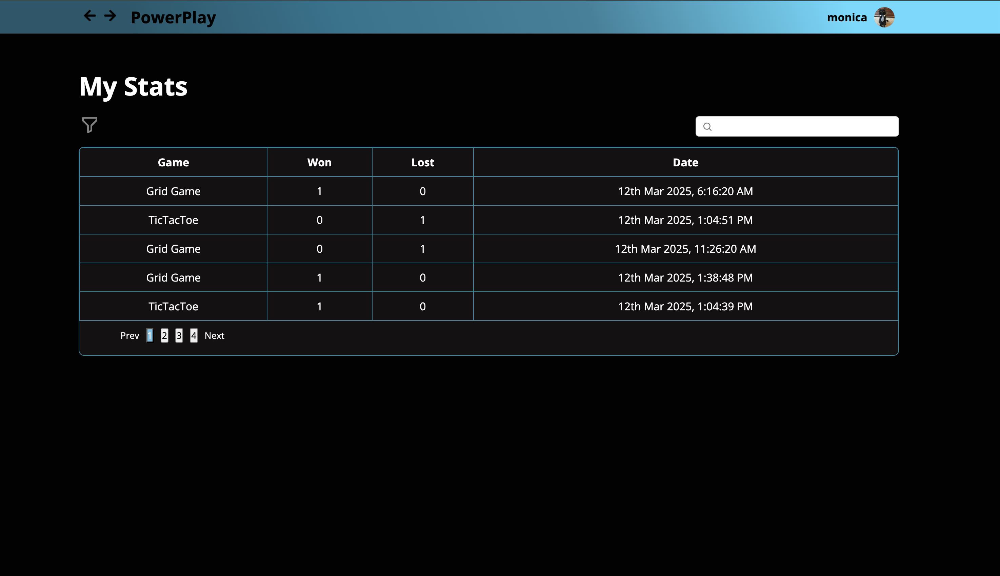

# PowerPlay

PowerPlay is a React-based web platform where users can browse and play classic games like Sudoku, TicTacToe, and Grid Game. User data and game stats are securely stored in Firebase.

## Tech Stack

- **Frontend**: React, JavaScript, React Router, Hooks
- **Backend**: Firebase (Firestore)
- **Styling**: SCSS

## Features

- User Login: Users must enter a username to access the platform.
- Game Listing: A clean list of available games for quick access.
- Game Play: Play Sudoku (iframe), Grid Game, and TicTacToe directly.
- Theme Support: Light and Dark mode toggle.
- Profile Upload: Supports drag-and-drop or file upload for profile images.
- Game Stats: Tracks user performance, showing results sorted by date (newest first) — 5 records per page.
- Currently, two official plugins are available:

## Structure

```bash
.
├── src
│   ├── App.jsx
│   ├── App.scss
│   ├── Components
│   │   ├── GameCard
│   │   ├── NavBar
│   │   ├── ProfileModal
│   │   └── Upload
│   ├── Games
│   │   ├── GridGame
│   │   ├── Sudoku
│   │   └── TicTacToe
│   ├── Pages
│   │   ├── ErrorPage
│   │   ├── GameList
│   │   ├── HomePage
│   │   ├── ProfilePage
│   │   ├── Routing
│   │   └── Stats
│   ├── Store
│   │   └── UserContext.jsx
│   ├── backend
│   │   └── firebase.js
│   ├── index.scss
│   ├── main.jsx
│   └── styles
│       └── variables.scss
└── vite.config.js
```

## Workflow

- **Home Page**: Users must log in with a username to unlock navigation.
- **Game List**: Displays all available games. Users select and start a game, results and stats get saved to Firestore automatically.
- **Profile**: Users can edit their profile (via Profile Icon & Edit button), Drag and drop or upload a profile image.
- **Stats Page**:Displays performance stats (5 records per page) sorted from newest to oldest.

## Screenshots








