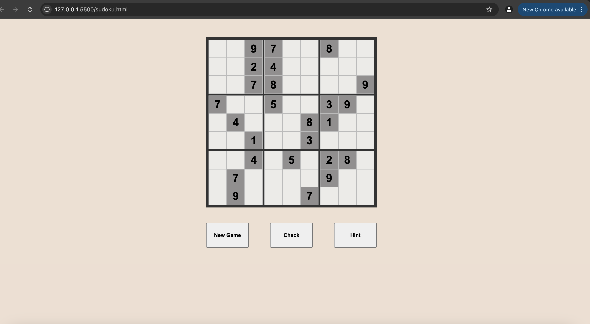
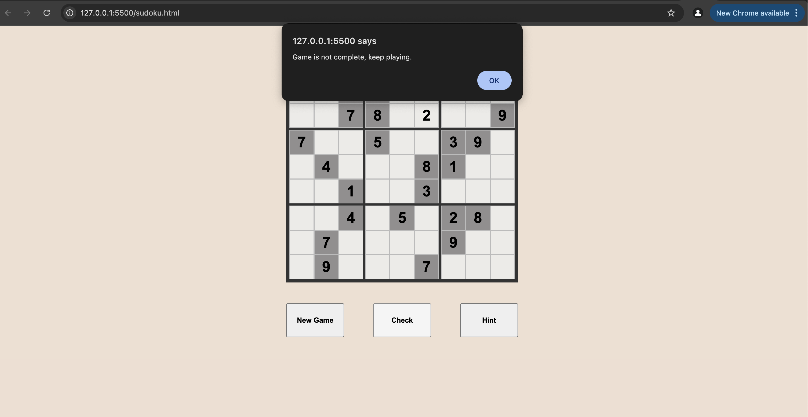
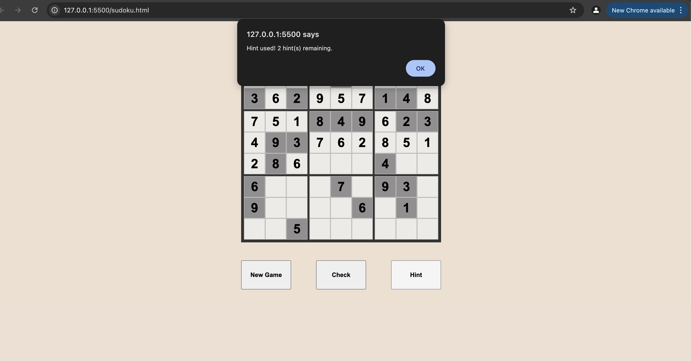
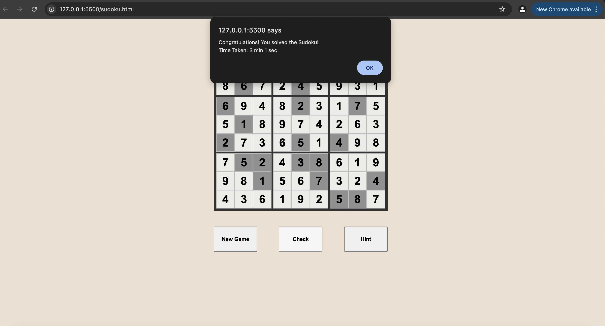
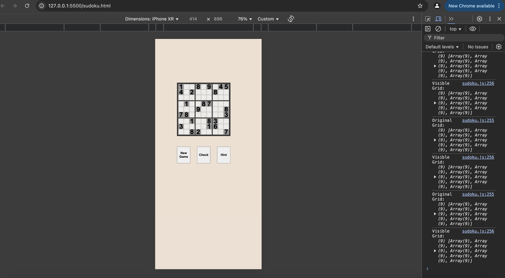

# Sudoku Game

An interactive Sudoku game implemented using **HTML, CSS, and Vanilla JavaScript**. It allows users to play a standard **9x9 Sudoku puzzle**, featuring number input validation, automatic grid updates, and game completion detection.

## Tech Stack

- **HTML** → Structure of the game
- **CSS** → Styling the game UI
- **JavaScript** → Game logic implementation

## Features

- Clean and responsive UI using HTML and CSS.
- Fully interactive 9x9 Sudoku board.
- Ability to set values in empty cells.
- New Game → Generates a fresh Sudoku puzzle.
- Check → Validates the board and determines win/loss and works only when all cells are filled.
- Hint → Provides a hint for a cell (limited to 3 hints per game).

## Architecture

### Frontend (User Interface)

- **HTML (`sudo_vanilla.html`)** → Provides the structure of the Sudoku board with a 9x9 grid.
- **CSS (`vanilla.css`)** → Styles the game board for a clean and user-friendly interface.

### JavaScript Logic (Game Engine)

#### Game Initialization

1. **Constructor Function** → Initializes the game with values and functions.
2. **`generateUUID`** → Generates a unique ID for each object using random functions and bitwise operators.
3. **`generateGrid`** → Generates the **original Sudoku grid**, ensuring unique numbers in every row, column, and 3×3 subgrid.
4. **`generateVisibleGrid`** → Displays only 25 numbers on the board while hiding the remaining 56 cells.
5. **`setValue(pos, value)`** → Allows users to input numbers into cells.
6. **`end()`** → Calculates the elapsed time and displays results based on `validate()`.
7. **`validate()`** → Checks if all rows, columns, and subgrids contain unique numbers **(1-9)**, returning `true` or `false`.
8. **`hint()`** → Provides a hint for an empty cell by revealing a value from the `originalGrid` (limited to 3 hints per game).

## Screenshots

